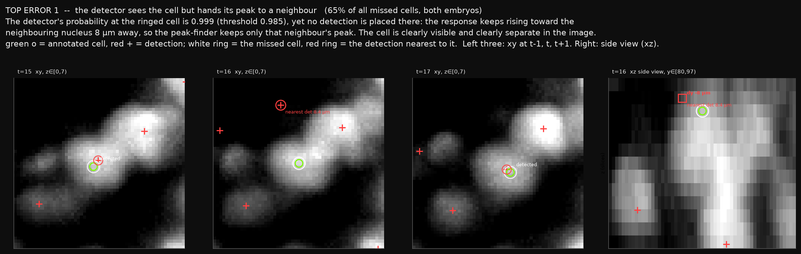
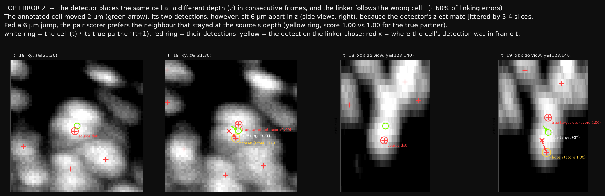
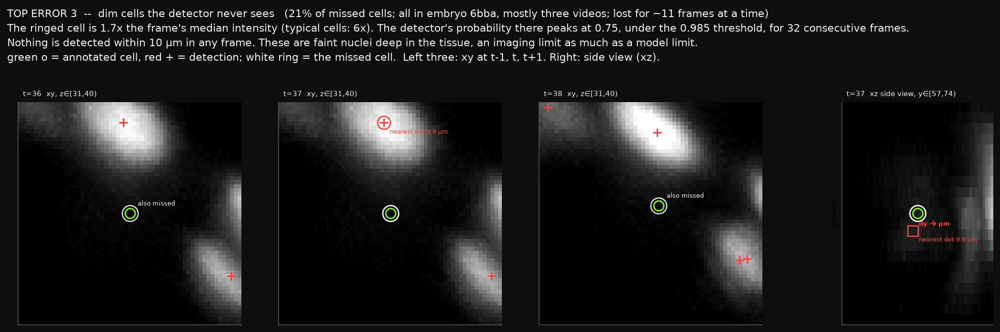

# The three errors that cost the most, one picture each

*Kai Gowers, 2026-09-16. Pipeline: the 0.842 leaderboard model, scored on 20 held-out videos it never saw. Every
picture is a typical case (the one closest to its category's median), not the worst one. Green circle = annotated
cell, red plus = our detection, white ring = the cell in question. Left three panels: top view at t-1, t, t+1. Right
panel: side view, depth (z) vertical. Full breakdown: `2026-09-16-error-categories-with-examples.md`.*

Where the missed links come from: 57% trace to a cell the detector did not find, 43% to the linker choosing wrongly
between detected cells.

## 1. The detector sees the cell but hands its peak to a neighbour (65% of missed cells)

The detector's probability at the ringed cell is 0.999, above the 0.985 threshold, yet no detection is placed there.
Its response keeps rising toward the neighbouring nucleus 8 µm away, and the peak-finder keeps one peak per 3 µm
window, so only the neighbour is detected. The neighbour is usually an unannotated cell, which is why this looked
like "nothing nearby" in the earlier analysis. It happens in both embryos, to cells of normal brightness, and in one
frame out of a track as often as for several frames. A looser peak-finder recovers two thirds of these cells but adds
20-30% more detections per frame, so the fix is not free.

## 2. The detector places the same cell at a different depth in consecutive frames, and the linker follows the wrong cell (about 60% of linking errors)

The annotated cell moved 2 µm. Its two detections sit 6 µm apart in depth (side views). Given a 6 µm jump, the pair
scorer prefers the neighbour that stayed at the same depth. In correct links the two detections differ by 0.6 µm in z;
in wrong links by 5 µm, while the annotated cells moved 1.6 µm in both cases. Nuclei are 2.5x longer along z than
across in these images, so the detector's response is flat along z and its depth estimate wobbles by one or two
slices. The linker is blamed for what is a detector localisation problem; the earlier "crowding" finding is mostly this.

## 3. Dim cells the detector never sees (21% of missed cells)

The ringed cell is 1.7x the frame's median intensity (typical cells: 6x). The detector's probability there peaks at
0.75, under threshold, for 32 consecutive frames. All of these are in embryo 6bba, three videos hold most of them, and
a lost cell stays lost for 11 frames at a time. Faint nuclei deep in the tissue: partly an imaging limit.

## Two smaller points

- Our local scoring code truncates coordinates to integers before the 7 µm match, while the submission rounds them.
  With float coordinates the held-out score is 0.811 instead of 0.807, and 12% of the "missed cells" disappear.
- The "large bright pre-mitotic nucleus" category from the previous report does not hold: those bright misses are not
  near annotated divisions, and most of them are case 1.
